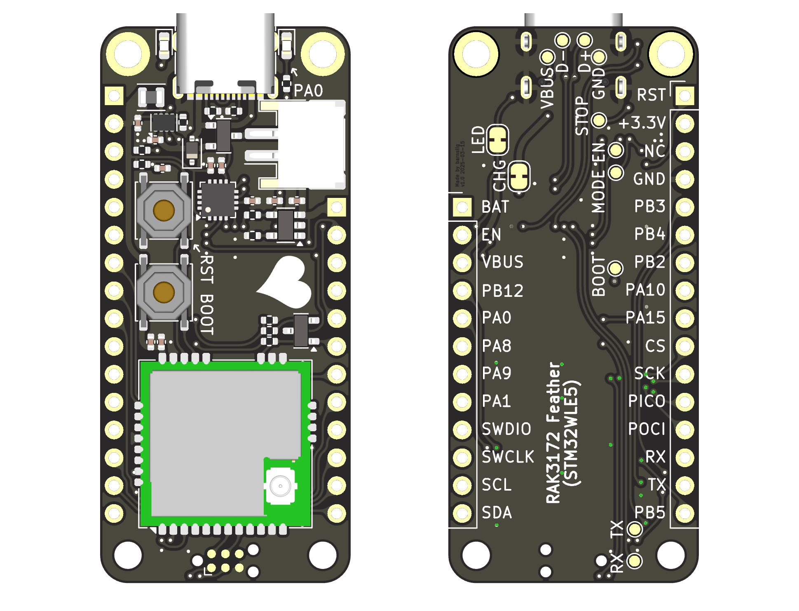
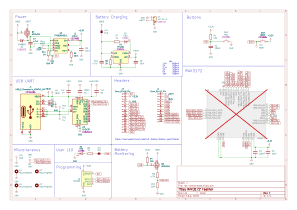

# RAK3172 Feather

The RAK3172 feather is a [LoRa](https://www.semtech.com/lora) development board, based on the popular [Adafruit Feather](https://learn.adafruit.com/adafruit-feather/feather-specification) format. It features the [STM32WLE5](https://www.st.com/en/microcontrollers-microprocessors/stm32wle5cc.html) 32-bit ARM Cortex-M4 microcontroller, with 256 Kbytes of Flash memory and 64 Kbytes of SRAM. Being optimized for ultra-low power using the [TPS62840](https://www.ti.com/product/de-de/TPS62840) step-down converter, the board can be used for rapid prototyping of battery-powered IoT sensor nodes.

To ease development, the board is equipped with an on-board [CH343P](https://www.wch-ic.com/products/CH343.html) USB-TTL and a 200mA [TP4054](https://www.umw-ic.com/static/pdf/46c15f53afcf69d99cf4bf3c625c6952.pdf) Li-Po battery charger.

## PCB

## Schematic

## Power

External power:

- Board can be powered via USB.
- Connect 3 - 6V DC to VBUS pin or BAT pin.

Battery:

- Connect battery using the JST PH-2 connector or via BAT pin.
- There is an integrated Li-Ion / Li-Po charger, powered via USB / VBUS pin.
- **Cut the CHG jumper on the backisde to disable the charger when using non-rechargeable batterys, e.g. Li-SoCl2 / Li-MnO2!**

Battery Monitoring:

- The voltage on BAT can be measured using the integrated ADC.
- Pull PA8 to GND.
- Measure voltage on PB3 / A0 using the integrated ADC.
- Calculate the battery voltage as follows: `mV * (4700 + 10000) / 10000`.

## User LED

- Integrated LED is connected to PA0 pin.
- Cut the LED jumper on the backside to use the PA0 pin for something else.

## Programming and Firmware

Factory firmware is RUI3 by RAKwireless. See [RAK3172 WisDuo LPWAN Module](https://docs.rakwireless.com/Product-Categories/WisDuo/RAK3172-Module/Overview/).

- Programming can be done via USB serial.
- For programming and debugging, use SWD via the TC2030 connector.

## License

See [LICENSE](./LICENSE).